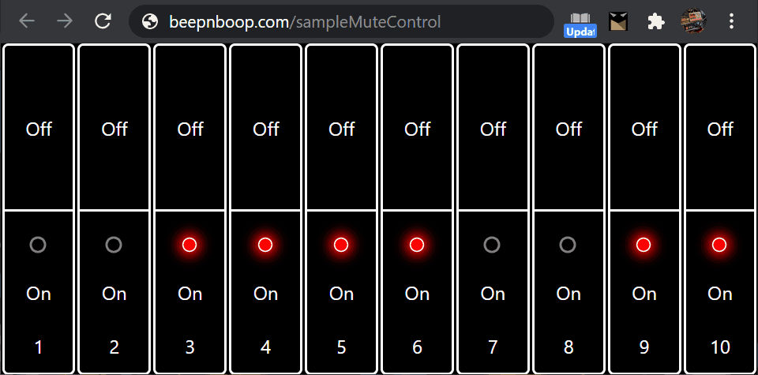

# SampleMuteControl

Use your phone to control your [pajen firmware modded](https://ranzee.com/volca-fm-firmware-1-09-unofficial/) Volca Sample!

[Try it now](https://beepnboop.com/SampleMuteControl) in Chrome browser!

Chrome browser has built in midi support, allowing us to invent new interfaces with web technology and a smartphone. __You must use chrome browser for the app to work.__

This app is experimental: so use it at your own risk... but you already voided your warranty with the Pajen firmware! Why not go further and start using your pocket supercomputer and your opposable thumbs (optional) to create a sick drop?